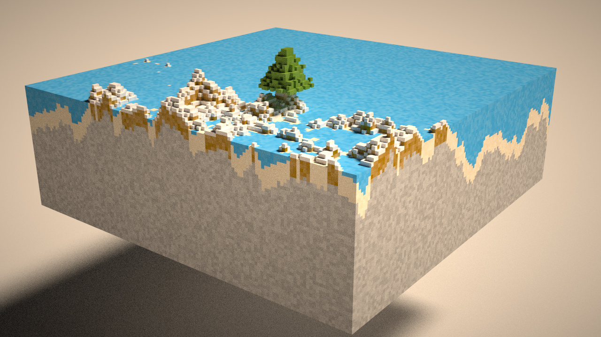

# <a name="title">Taichi Voxel Challenge</a>

<p align="center">
    
</p>

> Figure: result with `manual_seed, riverCount, treeCount = 3, 10, 10`

### Random generate terrain, river and trees like MineCraft

## Installation

Make sure your `pip` is up-to-date:

```bash
pip3 install pip --upgrade
```

Assume you have a Python 3 environment, simply run:

```bash
pip3 install -r requirements.txt
```

to install the dependencies of the voxel renderer.

## Quickstart

```sh
python3 main.py
```

Mouse and keyboard interface:

+ Drag with your left mouse button to rotate the camera.
+ Press `W/A/S/D/Q/E` to move the camera.
+ Press `P` to save a screenshot.
+ modify `manual_seed` to change what generated.
+ modify `riverCount` and `treeCount` to change how many rivers and trees generated.

## More picture

</img>
</img>
</img>
</img>
</img>
</img>
